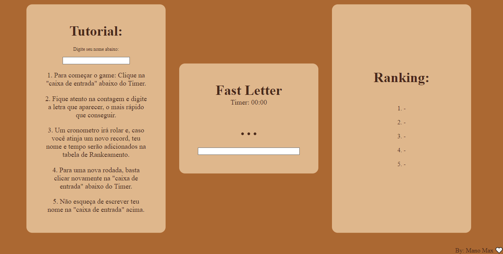

<h1> :video_game: Fast Letter </h1>
<h5>
  Solucion by: <a href="https://github.com/ManoMax">Mano Max</a> | Teacher: <a href="https://github.com/daltonserey">Dalton Serey</a>
</h5>

<p>
  <h5>Resumo:</h5>
  
  Fast Letter foi um desafio lançado pelo professor de Programação Web, Dalton Serey, e teve como objetivo, incentivar o uso de promisses, além de desafiar nossas habilidades com HTML, CSS e JavaScript.
  
  <h5>Objetivo:</h5>
  
  O objetivo no jogo é reagir a letra indicada o mais rápido possível, clicando na entrada, aguardando a contagem e digitando a letra indicada. Se o tempo de reação for menor que algum dos outros tempos já registrado no ranking, o jogo atualizará esse ranking.
</p>

____
<h4>Reprodução:</h4>



<h3> :game_die: Para rodar: </h3>

```bash
# Basta clonar o projeto e abrir o arquivo index.html em algum navegador.
```

<p><i>
  
>*Author: [@ManoMax](https://github.com/ManoMax)*

</i></p>

### Proposta do Professor:

# Reação

Escreva um pequeno jogo web (apenas frontend) que meça o tempo de
reação do usuário. O jogo consiste em fazer o usuário esperar um
tempo aleatório (curto, mas configurável) até que um elemento
visual seja adicionado ao DOM, indicando uma letra qualquer do
alfabeto. A partir desse momento, o tempo de reação do usuário
deve ser cronometrado até que ele pressione a tecla indicada.
Quando o usuário pressionar a tecla, o tempo total de espera deve
ser exibido na tela do usuário.

Use a API de `localstorage` no browser para armazenar os top-10 
recordes do usuário. De forma que cada vez que o usuário medir
seu tempo de reação, ele possa ser informado sobre a posição que
ocupou nos top-10 (ou se ele ficou abaixo).
